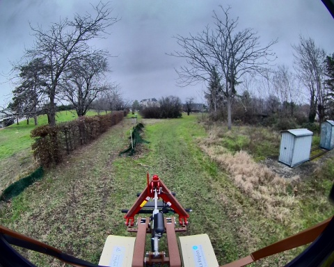
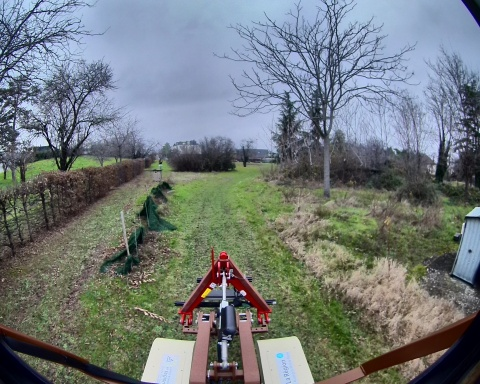
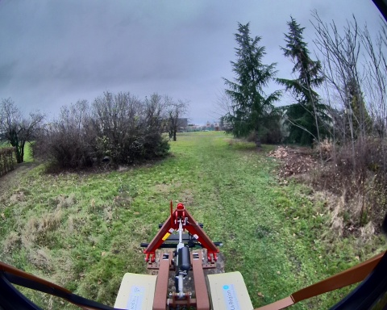

## loop_1_11_12_2024

**Chemin complet** : `/data/synchro_data/Innodura/Agrivia/Données/2024_bag/loop_1_11_12_2024`

#### [Trajectoire GPS](gps_traj.html)

### Images Associées

     
### Metadata

Files:             loop_1_11_12_2024_0.db3

Bag size:          4.5 GiB

Storage id:        sqlite3

Duration:          112.763904018s

Start:             Dec 11 2024 15:26:07.671964618 (1733927167.671964618)

End:               Dec 11 2024 15:28:00.435868636 (1733927280.435868636)

Messages:          86686

Topic information: Topic: /alpo/imu/velocity | Type: geometry_msgs/msg/TwistStamped | Count: 11265 | Serialization Format: cdr

                   Topic: /alpo/imu/mag | Type: sensor_msgs/msg/MagneticField | Count: 11265 | Serialization Format: cdr

                   Topic: /diagnostics | Type: diagnostic_msgs/msg/DiagnosticArray | Count: 1344 | Serialization Format: cdr

                   Topic: /alpo/gps/vel | Type: geometry_msgs/msg/TwistStamped | Count: 1110 | Serialization Format: cdr

                   Topic: /alpo/joystick/joy | Type: sensor_msgs/msg/Joy | Count: 885 | Serialization Format: cdr

                   Topic: /rosout | Type: rcl_interfaces/msg/Log | Count: 1273 | Serialization Format: cdr

                   Topic: /parameter_events | Type: rcl_interfaces/msg/ParameterEvent | Count: 0 | Serialization Format: cdr

                   Topic: /tf_static | Type: tf2_msgs/msg/TFMessage | Count: 6 | Serialization Format: cdr

                   Topic: /alpo/lidar/pointcloud_synchro | Type: sensor_msgs/msg/PointCloud2 | Count: 554 | Serialization Format: cdr

                   Topic: /alpo/imu/imu_data_str | Type: std_msgs/msg/String | Count: 11266 | Serialization Format: cdr

                   Topic: /tf | Type: tf2_msgs/msg/TFMessage | Count: 2027 | Serialization Format: cdr

                   Topic: /alpo/gps/nmea_sentence | Type: nmea_msgs/msg/Sentence | Count: 19142 | Serialization Format: cdr

                   Topic: /alpo/robot_description | Type: std_msgs/msg/String | Count: 1 | Serialization Format: cdr

                   Topic: /alpo/gps/fix | Type: sensor_msgs/msg/NavSatFix | Count: 1126 | Serialization Format: cdr

                   Topic: /alpo/imu/data | Type: sensor_msgs/msg/Imu | Count: 11265 | Serialization Format: cdr

                   Topic: /alpo/base/bridge/vehicle_controller/odom | Type: nav_msgs/msg/Odometry | Count: 1120 | Serialization Format: cdr

                   Topic: /alpo/camera/image_synchro | Type: sensor_msgs/msg/Image | Count: 554 | Serialization Format: cdr

                   Topic: /alpo/gps/ntrip/rtcm | Type: mavros_msgs/msg/RTCM | Count: 1217 | Serialization Format: cdr

                   Topic: /alpo/joint_states | Type: sensor_msgs/msg/JointState | Count: 11266 | Serialization Format: cdr

