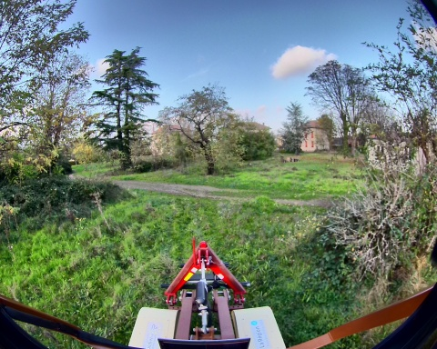
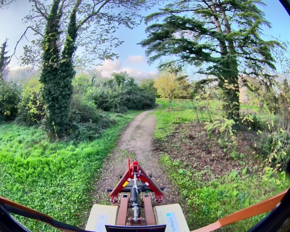
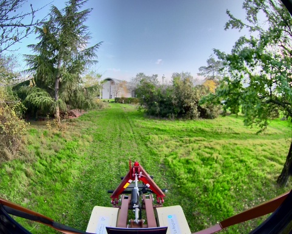

## loop_2_06_11_2024

**Chemin complet** : `/data/synchro_data/Innodura/Agrivia/Données/2024_bag/loop_2_06_11_2024`

#### [Trajectoire GPS](gps_traj.html)

### Images Associées

     
### Metadata

Files:             loop_2_06_11_2024_0.db3

Bag size:          4.6 GiB

Storage id:        sqlite3

Duration:          111.641693361s

Start:             Nov  6 2024 16:12:42.259393645 (1730905962.259393645)

End:               Nov  6 2024 16:14:33.901087006 (1730906073.901087006)

Messages:          83482

Topic information: Topic: /alpo/imu/mag | Type: sensor_msgs/msg/MagneticField | Count: 11153 | Serialization Format: cdr

                   Topic: /alpo/imu/imu_data_str | Type: std_msgs/msg/String | Count: 11153 | Serialization Format: cdr

                   Topic: /alpo/lidar/pointcloud_synchro | Type: sensor_msgs/msg/PointCloud2 | Count: 567 | Serialization Format: cdr

                   Topic: /alpo/imu/data | Type: sensor_msgs/msg/Imu | Count: 11153 | Serialization Format: cdr

                   Topic: /alpo/base/controller/odom | Type: nav_msgs/msg/Odometry | Count: 1070 | Serialization Format: cdr

                   Topic: /alpo/gps/nmea_sentence | Type: nmea_msgs/msg/Sentence | Count: 17849 | Serialization Format: cdr

                   Topic: /alpo/joint_states | Type: sensor_msgs/msg/JointState | Count: 10710 | Serialization Format: cdr

                   Topic: /alpo/base/controller/odometry | Type: romea_mobile_base_msgs/msg/OneAxleSteeringMeasureStamped | Count: 1069 | Serialization Format: cdr

                   Topic: /alpo/gps/ntrip/rtcm | Type: mavros_msgs/msg/RTCM | Count: 538 | Serialization Format: cdr

                   Topic: /parameter_events | Type: rcl_interfaces/msg/ParameterEvent | Count: 0 | Serialization Format: cdr

                   Topic: /rosout | Type: rcl_interfaces/msg/Log | Count: 1282 | Serialization Format: cdr

                   Topic: /alpo/joystick/joy | Type: sensor_msgs/msg/Joy | Count: 690 | Serialization Format: cdr

                   Topic: /diagnostics | Type: diagnostic_msgs/msg/DiagnosticArray | Count: 442 | Serialization Format: cdr

                   Topic: /alpo/gps/vel | Type: geometry_msgs/msg/TwistStamped | Count: 1102 | Serialization Format: cdr

                   Topic: /alpo/imu/velocity | Type: geometry_msgs/msg/TwistStamped | Count: 11153 | Serialization Format: cdr

                   Topic: /tf_static | Type: tf2_msgs/msg/TFMessage | Count: 6 | Serialization Format: cdr

                   Topic: /tf | Type: tf2_msgs/msg/TFMessage | Count: 1860 | Serialization Format: cdr

                   Topic: /alpo/gps/fix | Type: sensor_msgs/msg/NavSatFix | Count: 1116 | Serialization Format: cdr

                   Topic: /alpo/robot_description | Type: std_msgs/msg/String | Count: 1 | Serialization Format: cdr

                   Topic: /alpo/camera/image_synchro | Type: sensor_msgs/msg/Image | Count: 568 | Serialization Format: cdr

