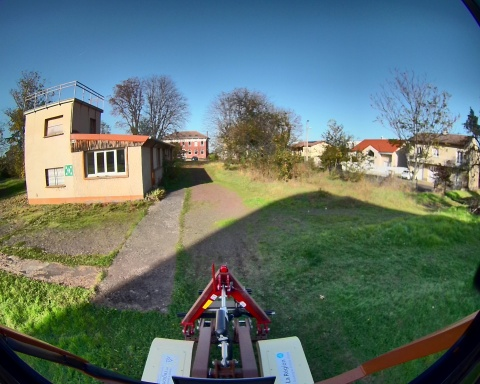
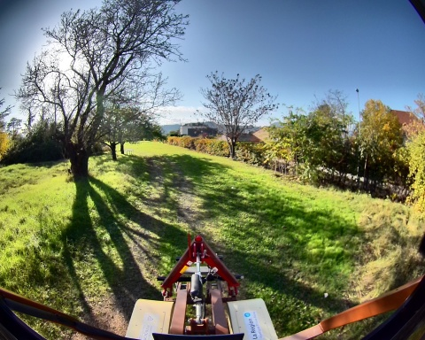
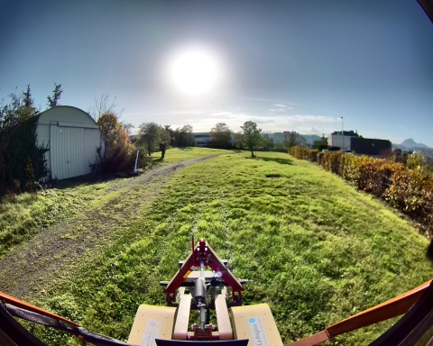
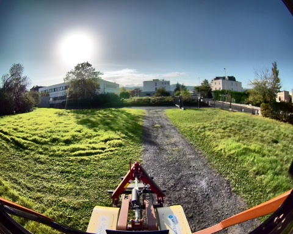

## loop_3_08_11_2024

**Chemin complet** : `/data/synchro_data/Innodura/Agrivia/Données/2024_bag/loop_3_08_11_2024`

#### [Trajectoire GPS](gps_traj.html)

### Images Associées

     
### Metadata

Files:             loop_3_08_11_2024_0.db3

Bag size:          17.8 GiB

Storage id:        sqlite3

Duration:          480.396929804s

Start:             Nov  8 2024 14:22:11.292631987 (1731072131.292631987)

End:               Nov  8 2024 14:30:11.689561791 (1731072611.689561791)

Messages:          355141

Topic information: Topic: /alpo/imu/data | Type: sensor_msgs/msg/Imu | Count: 48027 | Serialization Format: cdr

                   Topic: /alpo/base/controller/odom | Type: nav_msgs/msg/Odometry | Count: 4321 | Serialization Format: cdr

                   Topic: /alpo/gps/nmea_sentence | Type: nmea_msgs/msg/Sentence | Count: 78421 | Serialization Format: cdr

                   Topic: /alpo/gps/fix | Type: sensor_msgs/msg/NavSatFix | Count: 4803 | Serialization Format: cdr

                   Topic: /alpo/robot_description | Type: std_msgs/msg/String | Count: 1 | Serialization Format: cdr

                   Topic: /alpo/camera/image_synchro | Type: sensor_msgs/msg/Image | Count: 2161 | Serialization Format: cdr

                   Topic: /alpo/joint_states | Type: sensor_msgs/msg/JointState | Count: 43224 | Serialization Format: cdr

                   Topic: /rosout | Type: rcl_interfaces/msg/Log | Count: 4812 | Serialization Format: cdr

                   Topic: /alpo/joystick/joy | Type: sensor_msgs/msg/Joy | Count: 2396 | Serialization Format: cdr

                   Topic: /alpo/gps/vel | Type: geometry_msgs/msg/TwistStamped | Count: 4788 | Serialization Format: cdr

                   Topic: /diagnostics | Type: diagnostic_msgs/msg/DiagnosticArray | Count: 1697 | Serialization Format: cdr

                   Topic: /parameter_events | Type: rcl_interfaces/msg/ParameterEvent | Count: 0 | Serialization Format: cdr

                   Topic: /alpo/imu/velocity | Type: geometry_msgs/msg/TwistStamped | Count: 48028 | Serialization Format: cdr

                   Topic: /alpo/imu/mag | Type: sensor_msgs/msg/MagneticField | Count: 48028 | Serialization Format: cdr

                   Topic: /tf_static | Type: tf2_msgs/msg/TFMessage | Count: 6 | Serialization Format: cdr

                   Topic: /alpo/imu/imu_data_str | Type: std_msgs/msg/String | Count: 48028 | Serialization Format: cdr

                   Topic: /alpo/lidar/pointcloud_synchro | Type: sensor_msgs/msg/PointCloud2 | Count: 2161 | Serialization Format: cdr

                   Topic: /tf | Type: tf2_msgs/msg/TFMessage | Count: 7555 | Serialization Format: cdr

                   Topic: /alpo/base/controller/odometry | Type: romea_mobile_base_msgs/msg/OneAxleSteeringMeasureStamped | Count: 4321 | Serialization Format: cdr

                   Topic: /alpo/gps/ntrip/rtcm | Type: mavros_msgs/msg/RTCM | Count: 2363 | Serialization Format: cdr

