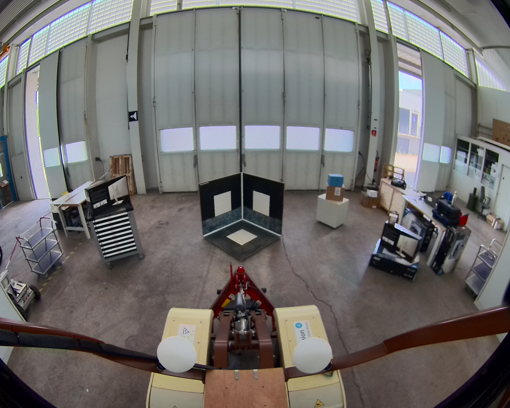
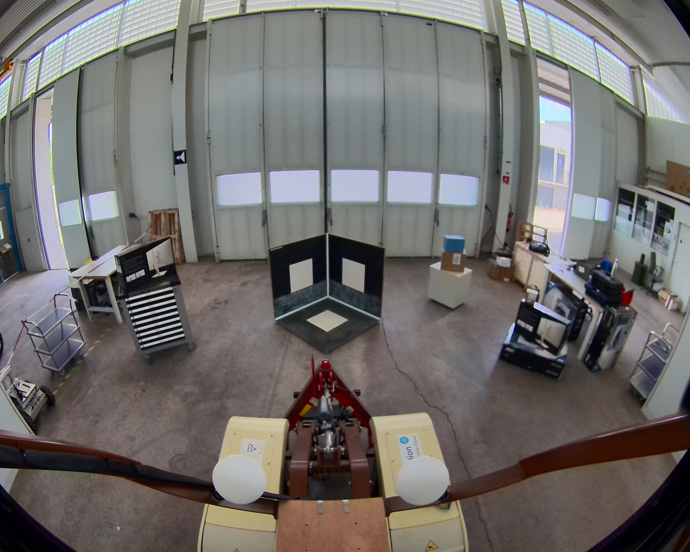

## record_calib_jc_1

**Chemin complet** : `/data/synchro_data/Innodura/Agrivia/Données/2024_bag/record_calib_jc_1`

#### [Trajectoire GPS](gps_traj.html)

### Images Associées

  
### Metadata

Files:             record_calib_jc_1_0.db3

Bag size:          64.9 MiB

Storage id:        sqlite3

Duration:          8.016553452s

Start:             Aug  8 2024 13:14:16.408256510 (1723115656.408256510)

End:               Aug  8 2024 13:14:24.424809962 (1723115664.424809962)

Messages:          14

Topic information: Topic: /alpo/camera/image_synchro | Type: sensor_msgs/msg/Image | Count: 9 | Serialization Format: cdr

                   Topic: /alpo/lidar/pointcloud_synchro | Type: sensor_msgs/msg/PointCloud2 | Count: 5 | Serialization Format: cdr

