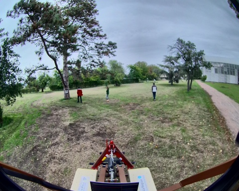
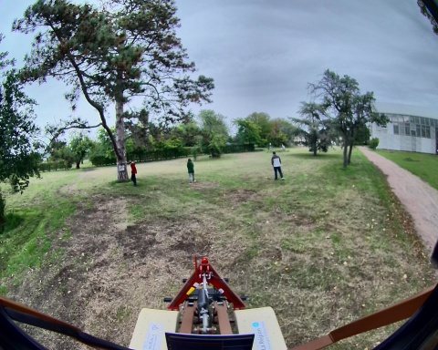
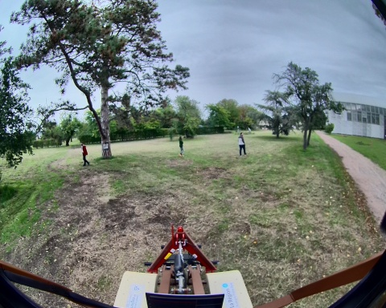
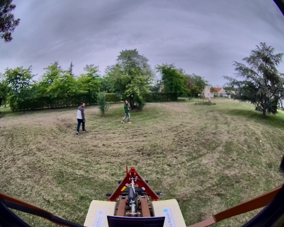

## record_dataset_1

**Chemin complet** : `/data/synchro_data/Innodura/Agrivia/Données/2024_bag/record_dataset_1`

#### [Trajectoire GPS](gps_traj.html)

### Images Associées

     
### Metadata

Files:             record_dataset_1_0.db3

Bag size:          1.3 GiB

Storage id:        sqlite3

Duration:          32.229092766s

Start:             Sep 25 2024 17:37:55.141051567 (1727278675.141051567)

End:               Sep 25 2024 17:38:27.370144333 (1727278707.370144333)

Messages:          23777

Topic information: Topic: /alpo/base/controller/odom | Type: nav_msgs/msg/Odometry | Count: 311 | Serialization Format: cdr

                   Topic: /alpo/gps/nmea_sentence | Type: nmea_msgs/msg/Sentence | Count: 5280 | Serialization Format: cdr

                   Topic: /alpo/imu/velocity | Type: geometry_msgs/msg/TwistStamped | Count: 3112 | Serialization Format: cdr

                   Topic: /alpo/joystick/joy/set_feedback | Type: sensor_msgs/msg/JoyFeedback | Count: 0 | Serialization Format: cdr

                   Topic: /alpo/imu/mag | Type: sensor_msgs/msg/MagneticField | Count: 3113 | Serialization Format: cdr

                   Topic: /alpo/gps/ntrip/nmea | Type: nmea_msgs/msg/Sentence | Count: 0 | Serialization Format: cdr

                   Topic: /parameter_events | Type: rcl_interfaces/msg/ParameterEvent | Count: 0 | Serialization Format: cdr

                   Topic: /alpo/joystick/joy | Type: sensor_msgs/msg/Joy | Count: 198 | Serialization Format: cdr

                   Topic: /alpo/gps/vel | Type: geometry_msgs/msg/TwistStamped | Count: 279 | Serialization Format: cdr

                   Topic: /rosout | Type: rcl_interfaces/msg/Log | Count: 40 | Serialization Format: cdr

                   Topic: /diagnostics | Type: diagnostic_msgs/msg/DiagnosticArray | Count: 126 | Serialization Format: cdr

                   Topic: /tf_static | Type: tf2_msgs/msg/TFMessage | Count: 4 | Serialization Format: cdr

                   Topic: /alpo/imu/imu_data_str | Type: std_msgs/msg/String | Count: 3114 | Serialization Format: cdr

                   Topic: /alpo/lidar/pointcloud_synchro | Type: sensor_msgs/msg/PointCloud2 | Count: 158 | Serialization Format: cdr

                   Topic: /alpo/camera/image_synchro | Type: sensor_msgs/msg/Image | Count: 161 | Serialization Format: cdr

                   Topic: /alpo/imu/data | Type: sensor_msgs/msg/Imu | Count: 3113 | Serialization Format: cdr

                   Topic: /alpo/base/bridge/vehicle_controller/odom | Type: nav_msgs/msg/Odometry | Count: 323 | Serialization Format: cdr

                   Topic: /tf | Type: tf2_msgs/msg/TFMessage | Count: 560 | Serialization Format: cdr

                   Topic: /alpo/gps/fix | Type: sensor_msgs/msg/NavSatFix | Count: 311 | Serialization Format: cdr

                   Topic: /alpo/robot_description | Type: std_msgs/msg/String | Count: 1 | Serialization Format: cdr

                   Topic: /alpo/gps/ntrip/rtcm | Type: mavros_msgs/msg/RTCM | Count: 147 | Serialization Format: cdr

                   Topic: /alpo/base/controller/odometry | Type: romea_mobile_base_msgs/msg/OneAxleSteeringMeasureStamped | Count: 312 | Serialization Format: cdr

                   Topic: /alpo/joint_states | Type: sensor_msgs/msg/JointState | Count: 3114 | Serialization Format: cdr

