## record_deplacement_1_16_09_2024

**Chemin complet** : `/data/synchro_data/Innodura/Agrivia/Données/2024_bag/record_deplacement_1_16_09_2024`

#### [Trajectoire GPS](gps_traj.html)

### Images Associées

 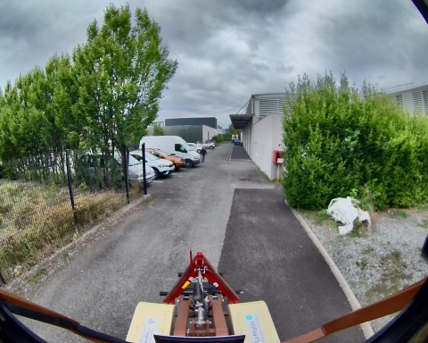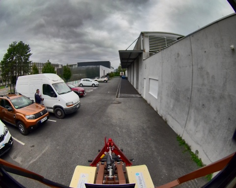 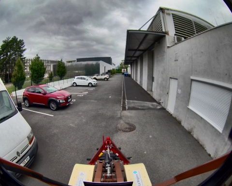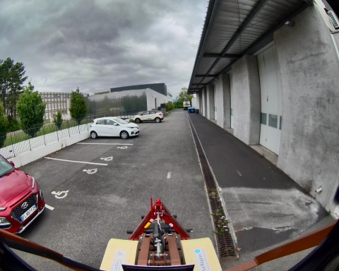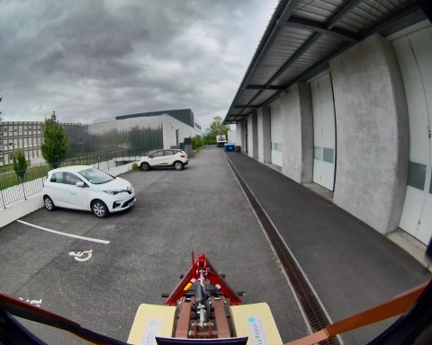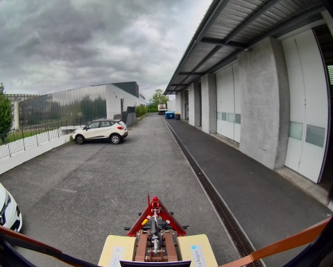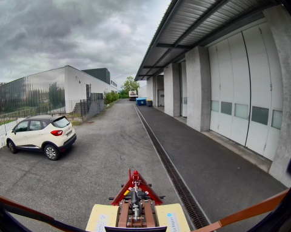 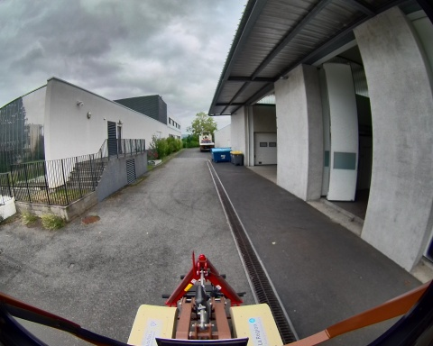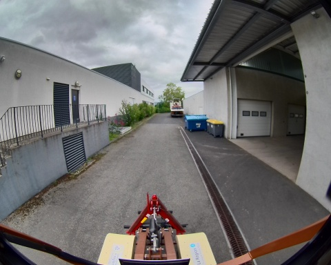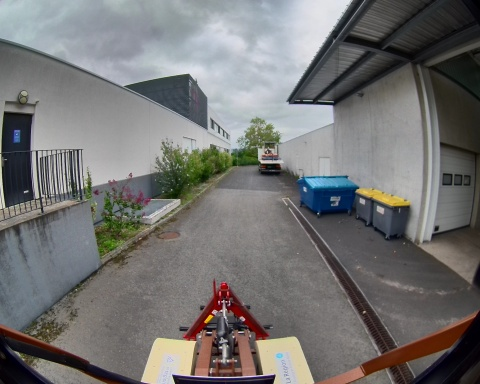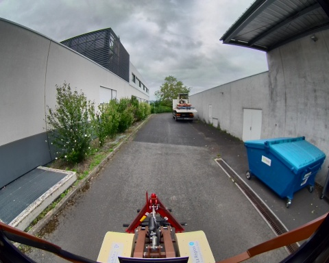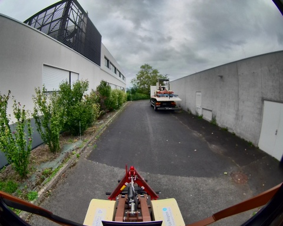 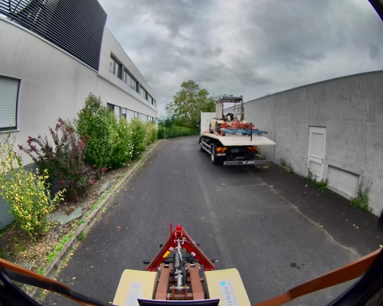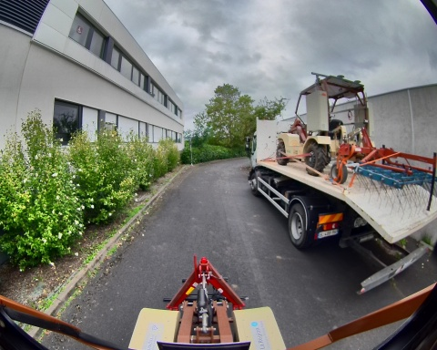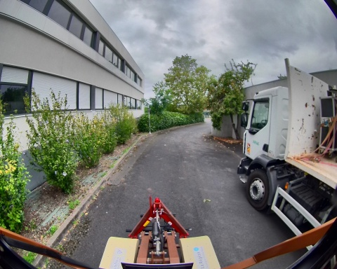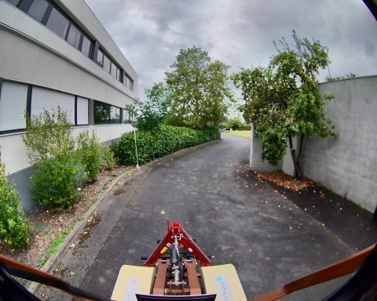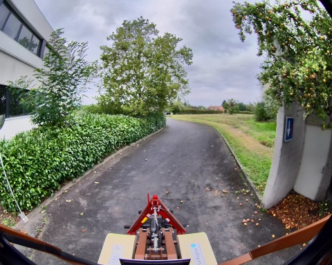 
### Metadata

Files:             record_deplacement_1_16_09_2024_0.db3

Bag size:          3.7 GiB

Storage id:        sqlite3

Duration:          68.630436042s

Start:             Sep 16 2024 17:30:28.241845388 (1726500628.241845388)

End:               Sep 16 2024 17:31:36.872281430 (1726500696.872281430)

Messages:          26612

Topic information: Topic: /alpo/camera/image_synchro | Type: sensor_msgs/msg/Image | Count: 350 | Serialization Format: cdr

                   Topic: /alpo/lidar/pointcloud_synchro_colorized | Type: sensor_msgs/msg/PointCloud2 | Count: 335 | Serialization Format: cdr

                   Topic: /alpo/lidar/pointcloud_synchro | Type: sensor_msgs/msg/PointCloud2 | Count: 352 | Serialization Format: cdr

                   Topic: /parameter_events | Type: rcl_interfaces/msg/ParameterEvent | Count: 0 | Serialization Format: cdr

                   Topic: /alpo/base/bridge/vehicle_controller/odom | Type: nav_msgs/msg/Odometry | Count: 685 | Serialization Format: cdr

                   Topic: /rosout | Type: rcl_interfaces/msg/Log | Count: 1758 | Serialization Format: cdr

                   Topic: /alpo/joystick/joy | Type: sensor_msgs/msg/Joy | Count: 497 | Serialization Format: cdr

                   Topic: /alpo/gps/vel | Type: geometry_msgs/msg/TwistStamped | Count: 672 | Serialization Format: cdr

                   Topic: /alpo/base/controller/odometry | Type: romea_mobile_base_msgs/msg/OneAxleSteeringMeasureStamped | Count: 700 | Serialization Format: cdr

                   Topic: /alpo/joint_states | Type: sensor_msgs/msg/JointState | Count: 6998 | Serialization Format: cdr

                   Topic: /alpo/base/controller/odom | Type: nav_msgs/msg/Odometry | Count: 700 | Serialization Format: cdr

                   Topic: /alpo/gps/nmea_sentence | Type: nmea_msgs/msg/Sentence | Count: 11642 | Serialization Format: cdr

                   Topic: /alpo/gps/fix | Type: sensor_msgs/msg/NavSatFix | Count: 687 | Serialization Format: cdr

                   Topic: /alpo/robot_description | Type: std_msgs/msg/String | Count: 1 | Serialization Format: cdr

                   Topic: /tf | Type: tf2_msgs/msg/TFMessage | Count: 1231 | Serialization Format: cdr

                   Topic: /tf_static | Type: tf2_msgs/msg/TFMessage | Count: 4 | Serialization Format: cdr

