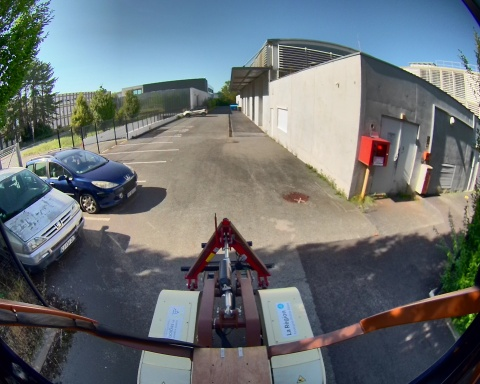
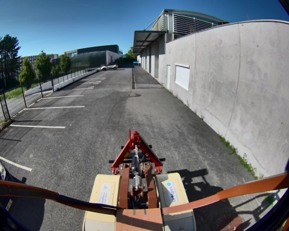
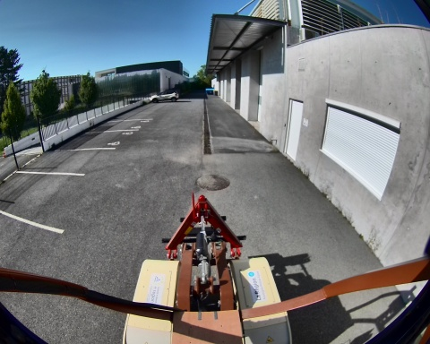
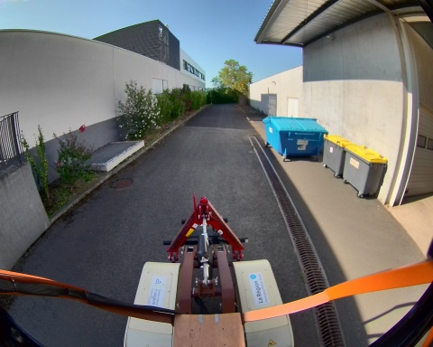
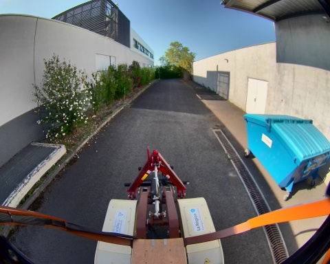
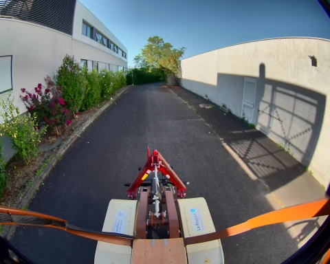
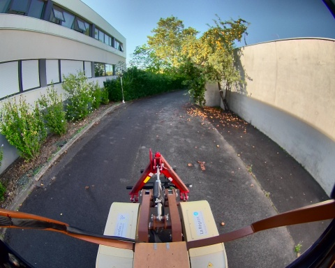

## slam_icp_batiment_a

**Chemin complet** : `/data/synchro_data/Innodura/Agrivia/Données/2024_bag/slam_icp_batiment_a`

#### [Trajectoire GPS](gps_traj.html)

### Images Associées

     
### Metadata

Files:             slam_icp_batiment_a_0.db3

Bag size:          4.1 GiB

Storage id:        sqlite3

Duration:          98.496866947s

Start:             Aug 27 2024 16:54:55.687112794 (1724770495.687112794)

End:               Aug 27 2024 16:56:34.183979741 (1724770594.183979741)

Messages:          987

Topic information: Topic: /alpo/camera/image_synchro | Type: sensor_msgs/msg/Image | Count: 492 | Serialization Format: cdr

                   Topic: /tf_static | Type: tf2_msgs/msg/TFMessage | Count: 3 | Serialization Format: cdr

                   Topic: /alpo/lidar/pointcloud_synchro | Type: sensor_msgs/msg/PointCloud2 | Count: 492 | Serialization Format: cdr

