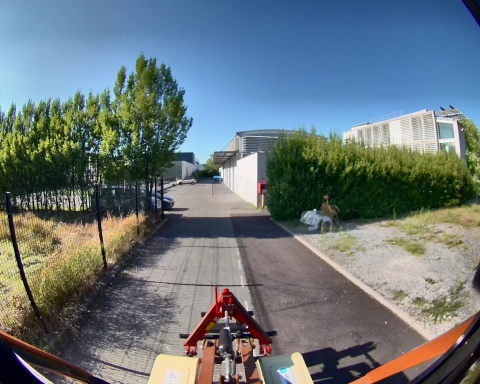
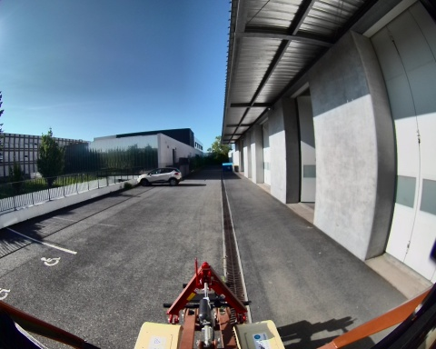

## slam_icp_batiment_c

**Chemin complet** : `/data/synchro_data/Innodura/Agrivia/Données/2024_bag/slam_icp_batiment_c`

#### [Trajectoire GPS](gps_traj.html)

### Images Associées

     
### Metadata

Files:             slam_icp_batiment_c_0.db3

Bag size:          3.9 GiB

Storage id:        sqlite3

Duration:          94.661037931s

Start:             Aug 27 2024 17:27:02.561943294 (1724772422.561943294)

End:               Aug 27 2024 17:28:37.222981225 (1724772517.222981225)

Messages:          951

Topic information: Topic: /alpo/camera/image_synchro | Type: sensor_msgs/msg/Image | Count: 474 | Serialization Format: cdr

                   Topic: /tf_static | Type: tf2_msgs/msg/TFMessage | Count: 3 | Serialization Format: cdr

                   Topic: /alpo/lidar/pointcloud_synchro | Type: sensor_msgs/msg/PointCloud2 | Count: 474 | Serialization Format: cdr

