## slam_icp_foret_b

**Chemin complet** : `/data/synchro_data/Innodura/Agrivia/Données/2024_bag/slam_icp_foret_b`

#### [Trajectoire GPS](gps_traj.html)

### Images Associées

  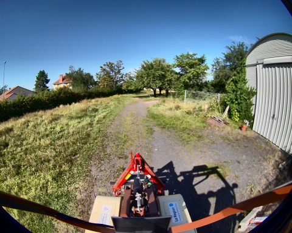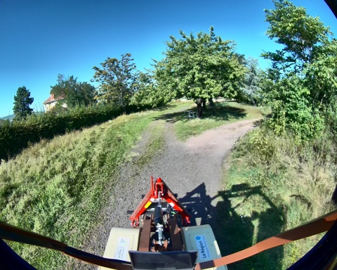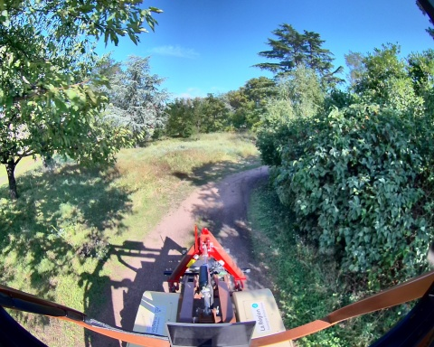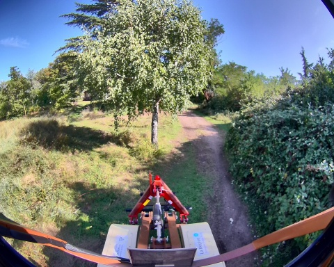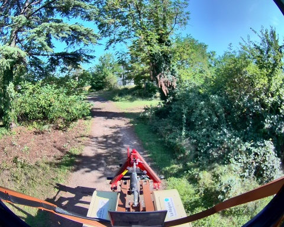 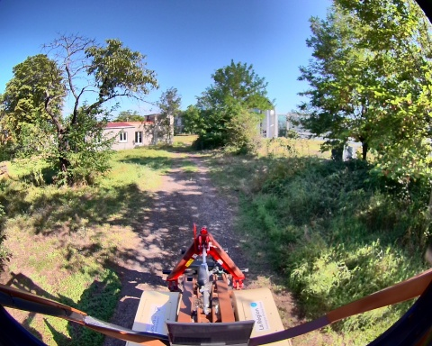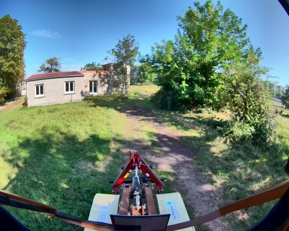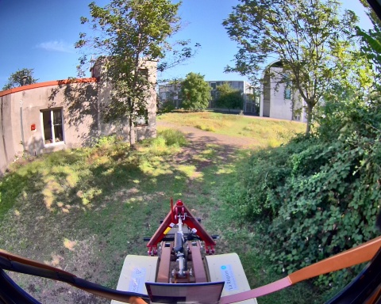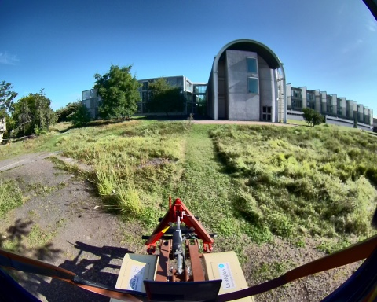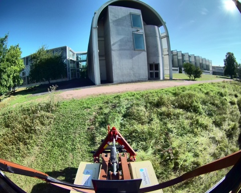 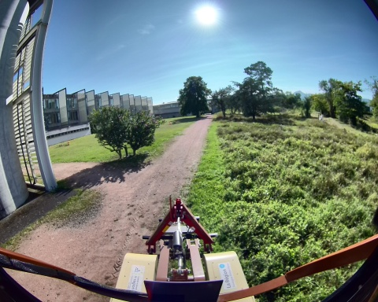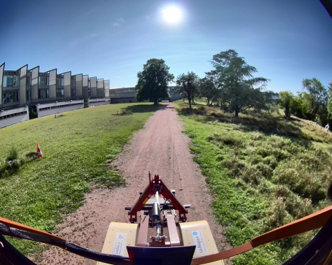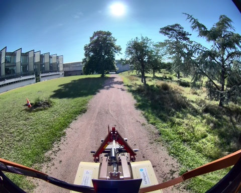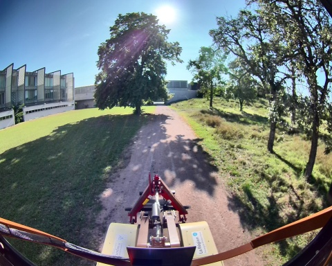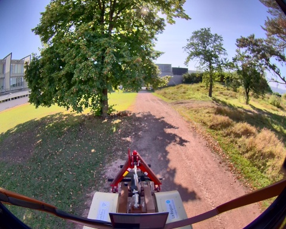 
### Metadata

Files:             slam_icp_foret_b_0.db3

Bag size:          7.8 GiB

Storage id:        sqlite3

Duration:          188.696040407s

Start:             Aug 27 2024 17:17:05.747779590 (1724771825.747779590)

End:               Aug 27 2024 17:20:14.443819997 (1724772014.443819997)

Messages:          1889

Topic information: Topic: /alpo/camera/image_synchro | Type: sensor_msgs/msg/Image | Count: 943 | Serialization Format: cdr

                   Topic: /alpo/lidar/pointcloud_synchro | Type: sensor_msgs/msg/PointCloud2 | Count: 943 | Serialization Format: cdr

                   Topic: /tf_static | Type: tf2_msgs/msg/TFMessage | Count: 3 | Serialization Format: cdr

