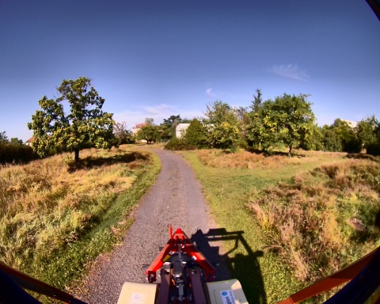
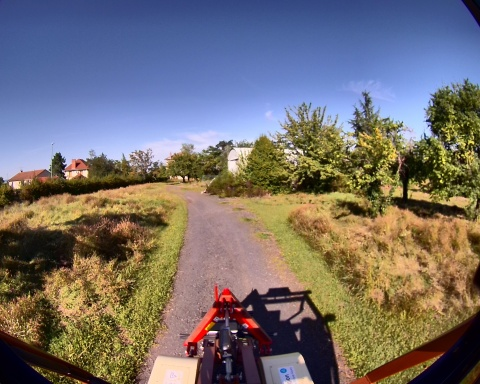

## slam_icp_foret_c

**Chemin complet** : `/data/synchro_data/Innodura/Agrivia/Données/2024_bag/slam_icp_foret_c`

#### [Trajectoire GPS](gps_traj.html)

### Images Associées

    
### Metadata

Files:             slam_icp_foret_c_0.db3

Bag size:          8.1 GiB

Storage id:        sqlite3

Duration:          201.335897004s

Start:             Aug 27 2024 17:29:32.215394944 (1724772572.215394944)

End:               Aug 27 2024 17:32:53.551291948 (1724772773.551291948)

Messages:          2017

Topic information: Topic: /tf_static | Type: tf2_msgs/msg/TFMessage | Count: 3 | Serialization Format: cdr

                   Topic: /alpo/lidar/pointcloud_synchro | Type: sensor_msgs/msg/PointCloud2 | Count: 1007 | Serialization Format: cdr

                   Topic: /alpo/camera/image_synchro | Type: sensor_msgs/msg/Image | Count: 1007 | Serialization Format: cdr

